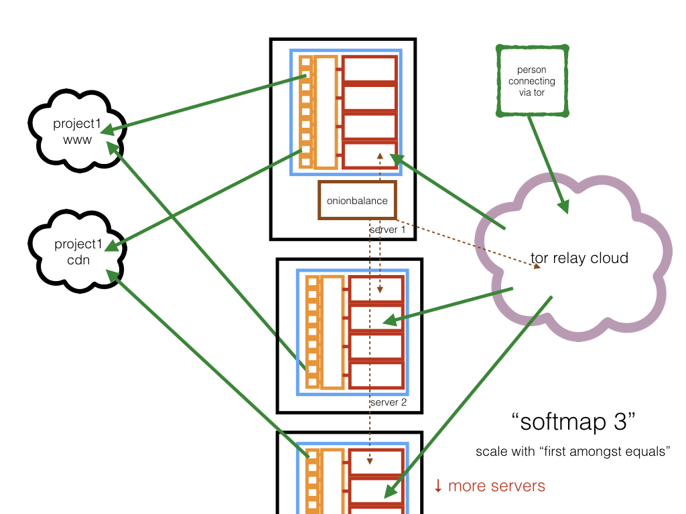

# The Enterprise Onion Toolkit
## eotk (c) 2017 Alec Muffett

## Primary Supported Platforms

* OSX Sierra with Homebrew, Latest Updates
* Raspbian Jessie/Jessie-Lite, Latest Updates
* Ubuntu 16.04+, Latest Updates

## Changes

### v1.2
* custom install process for Ubuntu, tested on Ubuntu Server 16.04.2-LTS
* renaming / factor-out of Raspbian install code
* fixes to onionbalance support

### v1.1
* first cut of onionbalance / softmap

### v1.0
* have declared a stable alpha release
* architecture images, at bottom of this page
* all of CSP, HSTS and HPKP are suppressed by default; onion networking mitigates much of this
* ["tunables"](TUNEABLES.md) documentation for template content
* `troubleshooting` section near the bottom of this page
* See [project activity](https://github.com/alecmuffett/eotk/graphs/commit-activity) for information

## Introduction

The goal of EOTK is to provide a tool for prototyping, and deploying
at scale, HTTP and HTTPS onion sites to provide official presence for
popular websites.

The results are essentially a "man in the middle" proxy; set them up
only for your own sites or for sites which do not require login
credentials of any kind.

The resulting NGINX configs are probably both buggy and not terribly
well tuned; please consider this project to be very much "early days",
but I shall try not to modify the configuration file format.

The `softmap` support is untested, and needs some more work to make it
nice to launch and integrate with OnionBalance; please avoid it for
the moment.

## An Important Note About Anonymity

The presumed use-case of EOTK is that you have an already-public
website and that you wish to give it a corresponding Onion address.

A lot of people mistakenly believe that Tor Onion Networking is "all
about anonymity" - which is incorrect, since it also includes:

* extra privacy
* identity/surety of to whom you are connected
* freedom from oversight/network surveillance
* anti-blocking, and...
* enhanced integrity/tamperproofing

...none of which are the same as "anonymity", but all of which are
valuable qualities to add to communications.

Also: setting up an Onion address can provide less contention, more
speed & more bandwidth to people accessing your site than they would
get by using Tor "Exit Nodes".

If you set up EOTK in its intended mode then your resulting site is
almost certainly not going to be anonymous; for one thing your brand
name (etc) will likely be plastered all over it.

If you want to set up a server which includes anonymity **as well as**
all of the aforementioned qualities, you
[want to be reading an entirely different document, instead](https://github.com/alecmuffett/the-onion-diaries/blob/master/basic-production-onion-server.md).

## Usage Notes

When connecting to the resulting onions over HTTP/SSL, you will be
using wildcard self-signed SSL certificates - you *will* encounter
many "broken links" which are due to the SSL certificate not being
valid.  This is *expected* and *proper* behaviour.

To help cope with this, for any domain (eg:
www.foofoofoofoofoof.onion) the EOTK provides a fixed url:

* `https://www.foofoofoofoofoof.onion/hello-onion/`

...which (`/hello-onion/`) is internally served by the NGINX proxy and
provides a stable, fixed URL for SSL certificate acceptance; inside
TorBrowser another effective solution is to open all the broken links,
images and resources "in a new Tab" and accept the certificate there.

In production, of course, one would expect to use an SSL EV
certificate to provide identity and assurance to an onion site,
rendering these issues moot.

## Requirements

* `tor` (latest stable)
* `nginx` (latest stable) with the following features & modules
  * `headers_more`
  * `ngx_http_substitutions_filter_module`
  * `http_sub`
  * `http_ssl`

On Linux, instructions are provided to help install, or scripts are provided to compile these.

On OSX, these are available via Homebrew.

## Video Demonstrations

* [Basic Introduction to EOTK](https://www.youtube.com/watch?v=ti_VkVmE3J4)
* [Rough Edges: SSL Certificates & Strange Behaviour](https://www.youtube.com/watch?v=UieLTllLPlQ)

## Command List

### Configuration

* `eotk config [filename]` # default `onions.conf`
  * *synonyms:* `conf`, `configure`
  * parses the config file and sets up and populates the projects
* `eotk maps projectname ...` # or: `-a` for all
  * prints which onions correspond to which dns domains
  * for softmap, this list may not show until after `ob-config` and `ob-start`
* `eotk harvest projectname ...` # or: `-a` for all
  * *synonyms:* `onions`
  * prints list of onions used by projects

### Onion Generation

* `eotk genkey`
  * *synonyms:* `gen`
  * generate an onion key and stash it in `secrets.d`

### Project Status & Debugging

* `eotk status projectname ...` # or: `-a` for all
  * active per-project status
* `eotk ps`
  * do a basic grep for possibly-orphaned processes
* `eotk debugon projectname ...` # or: `-a` for all
  * enable verbose tor logs
* `eotk debugoff projectname ...` # or: `-a` for all
  * disable verbose tor logs

### Starting & Stopping Projects

* `eotk start projectname ...` # or: `-a` for all
  * start projects
* `eotk stop projectname ...` # or: `-a` for all
  * stop projects
* `eotk restart projectname ...` # or: `-a` for all
  * *synonyms:* `bounce`, `reload`
  * stop, and restart, projects
* `eotk nxreload projectname ...` # or: `-a` for all
  * politely ask NGINX to reload its config files


### Starting & Stopping OnionBalance

* `eotk ob-config projectname ...` # or: `-a` for all, if applicable
  * *synonyms:*
* `eotk ob-start`
  * *synonyms:*
* `eotk ob-restart projectname ...` # or: `-a` for all, if applicable
  * *synonyms:*
* `eotk ob-stop`
  * *synonyms:*
* `eotk ob-status`
  * *synonyms:*

### Configuring Remote Workers

* `eotk-workers.conf`
  * if not present, only `localhost` will be used
  * if present, contains one hostname per line, no comments
    * the label `localhost` is a hardcoded synonym for local activity
    * other (remote) systems are accessed via `ssh`, `scp` & `rsync`
* `eotk ob-remote-nuke-and-push`
  * *synonyms:*
* `eotk ob-nxpush`
  * *synonyms:*
* `eotk ob-torpush`
  * *synonyms:*
* `eotk ob-spotpush`
  * *synonyms:*

### Backing-Up Remote Workers

* eotk `mirror`
  * *synonyms:*
* eotk `backup`
  * *synonyms:*

## Installation

### OSX

Currently works on OSX with Homebrew:

* install homebrew - http://brew.sh/
* `git clone https://github.com/alecmuffett/eotk.git`
* `cd eotk`
* `sh ./000-setup-osx.sh` # installs required software; if you're
  worried, check it first

### Ubuntu

* `git clone https://github.com/alecmuffett/eotk.git`
* `cd eotk`
* **Read** [000-setup-ubuntu.md](000-setup-raspbian.md) and follow the instructions.

### Raspbian

* `git clone https://github.com/alecmuffett/eotk.git`
* `cd eotk`
* **Read** [000-setup-raspbian.md](000-setup-raspbian.md) and follow the instructions.

### Debian

Not sure.  Somewhere between Ubuntu and Raspbian may work.

## I don't own a site, but I want to experiment!

If you want to experiment with some prefabricated projects, try this:

* `sh ./010-configure-demo.sh` # creates a working config file + tor & nginx config files
* `eotk start default`
* Now you can...
  * Connect to one of the onions cited on screen for the `default`
    project
  * Play SSL-Certificate-Acceptance-Whackamole
  * Browse a little...
* `eotk stop default`

## This involves lots of software, do you have something similar I can play with?

There's
[another document I wrote](https://github.com/alecmuffett/the-onion-diaries/blob/master/building-proof-of-concept.md),
showing how to do something very similar to `eotk` by using a tool
called `mitmproxy`; if you can use a Linux commandline it will give
you something relevant to play with, and you won't have to setup
anything permanent.

## I want to create a new project / my own configuration!

You can either add a new project to the demo config file, or you can
create a new config for yourself.

If you want an onion for `foo.com`, the simplest configuration file
looks like this:

```
set project myproject
hardmap secrets.d/a2s3c4d5e6f7g8h9.key foo.com
```

...and if you create a file called `project.conf` containing those
lines, then you should be able to do:

```
eotk configure project.conf
eotk start myproject
```

See also: the next question:

### But how do I create my own Onion Address?

#### MANUAL METHOD

* Do `eotk genkey` - it will print the name of the onion it generates
  * Do this as many times as you wish/need.
* Alternately get a tool like `scallion` or `shallot` and use that to
  "mine" a desirable onion address.
  * https://github.com/katmagic/Shallot - in C, for CPUs
    * Seems okay on Linux, not sure about other platforms
  * https://github.com/lachesis/scallion - in C#, for CPUs & GPUs (GPU == very fast)
    * Advertised as working on Windows, Linux; works well on OSX under "Mono"
* Be sure to store your mined private keys in `secrets.d` with a
  filename like `a2s3c4d5e6f7g8h9.key` where `a2s3c4d5e6f7g8h9` is the
  corresponding onion address.

#### AUTOMATIC METHOD

Create a config file with a `.tconf` suffix, and use this syntax:

```
set project myproject
hardmap %NEW_ONION% foo.com
hardmap %NEW_ONION% foo.co.uk
hardmap %NEW_ONION% foo.de
```

...and then run `eotk config foo.tconf`; this will create the onions
for you and will populate a `foo.conf` for you, and it will configure
from *that*.

You should probably *delete* `foo.tconf` afterwards, since reusing it
will trash your existing onions.

## Help! I have both www.foo.com and www.DEV.foo.com!

### A Little Background

When you are setting up the mappings in a config file, you may have to
accomodate "subdomains"; the general form of a internet hostname is
like this:

* `hostname.domain.tld` # like: www.facebook.com or www.gov.uk
  * or: `hostname.domain.sld.tld` # like: www.amazon.co.uk
* `hostname.subdom.domain.tld` # like: www.prod.facebook.com
* `hostname.subsubdom.subdom.domain.tld` # cdn.lhr.eu.foo.net
* `hostname.subsubsubdom.subsubdom.subdom.domain.tld` # ...

...and so on, where:

* tld = [top level domain](https://en.wikipedia.org/wiki/Top-level_domain)
  * sld = [second level domain](https://en.wikipedia.org/wiki/.uk#Second-level_domains)
* domain = *generally the name of the organisation you are interested in*
* subdomain = *some kind of internal structure*
* hostname = *actual computer, or equivalent*

When you are setting up mappings, generally the rules are:

* you will **map one domain per onion**
* you will **ignore all hostnames**
* you will **append all possible subdomain stems**

So if your browser tells you that you are fetching content from
`cdn7.dublin.ireland.europe.foo.co.jp`, you should add a line like:

```
hardmap %NEW_ONION% foo.co.jp europe ireland.europe dublin.ireland.europe
```

...and EOTK should do the rest. All this is necessary purely for
correctness of the self-signed SSL-Certificates - which are going to
be weird, anyway - and the rest of the HTML-rewriting code in EOTK
will be blind to subdomains.

### Solution

Subdomains are supported like this:

```
set project myproject
hardmap secrets.d/a2s3c4d5e6f7g8h9.key foo.com dev
```

...and if you have multiple subdomains:

```
hardmap secrets.d/a2s3c4d5e6f7g8h9.key foo.com dev blogs dev.blogs [...]
```

## My company has a bunch of site/domains!

Example: `www.foo.com.au`, `www.syd.foo.com.au`, `www.per.foo.com.au`,
`www.cdn.foo.net`, `www.foo.aws.amazon.com`...

Put them all in the same project as separate mappings, remembering to
avoid "hostnames" as above:

```
set project fooproj
hardmap %NEW_ONION% foo.com.au syd per
hardmap %NEW_ONION% foo.net cdn
hardmap %NEW_ONION% foo.aws.amazon.com
```

Onion mapping/translations will be applied for all sites in the same project.


## Troubleshooting

Firstly, the logs for any given project will reside in `projects.d/<PROJECTNAME>.d/logs.d/`

If something is problematic, first try:

* `git pull` and...
* `eotk config <filename>.conf` again, and then...
* `eotk bounce -a`

### Lots of broken images, missing images, missing CSS

This is probably an SSL/HTTPS thing.

Because of the nature of SSL self-signed certificates, you have to
manually accept the certificate of each and every site for which a
certificate has been created. See the second of the YouTube videos for
some mention of this.

In short: this is normal and expected behaviour.  You can temporarily
fix this by:

* right-clicking on the image for `Open In New Tab`, and accepting the
  certificate
* or using `Inspect Element > Network` to find broken resources, and
  doing the same
* or - if you know the list of domains in advance - visiting the
  `/hello-onion/` URL for each of them, in advance, to accept
  certificates.

If you get an
[official SSL certificate for your onion site](https://blog.digicert.com/ordering-a-onion-certificate-from-digicert/)
then the problem will vanish. Until then, I am afraid that you will be
stuck playing certificate "whack-a-mole".

### NGINX: Bad Gateway

Generally this means that NGINX cannot connect to the remote website,
which usually happens because:

* the site name in the config file, is wrong
* the nginx daemon tries to do a DNS resolution, which fails

Check the NGINX logfiles in the directory cited above, for
confirmation.

If DNS resolution is failing, *PROBABLY* the cause is probably lack
of access to Google DNS / 8.8.8.8; therefore in your config file
you should add a line like this - to use `localhost` as an example:

```
set nginx_resolver 127.0.0.1
```

...and then do:

```
eotk stop -a
eotk config filename.conf
eotk start -a
```

If you need a local DNS resolver, I recommend `dnsmasq`.

### I can't connect, it's just hanging

If your onion project has just started, it can take up to a few
minutes to connect for the first time; also sometimes TorBrowser
caches stale descriptors for older onions.  Try restarting TorBrowser
(or use the `New Identity` menu item) and have a cup of tea.  If it
persists, check the logfiles.

### Help I'm Stuck!

Ping @alecmuffett on Twitter, or log an `Issue`, above.

## Acknowledgements

EOTK stands largely on the experience of work I led at Facebook to
create `www.facebookcorewwwi.onion`, but it owes a *huge* debt to
[Mike Tigas](https://github.com/mtigas)'s work at ProPublica to put
their site into Onionspace through using NGINX as a rewriting proxy --
and that
[he wrote the whole experience up in great detail](https://www.propublica.org/nerds/item/a-more-secure-and-anonymous-propublica-using-tor-hidden-services)
including
[sample config files](https://gist.github.com/mtigas/9a7425dfdacda15790b2).

Reading this prodded me to learn about NGINX and then aim to shrink &
genericise the solution; so thanks, Mike!

Also, thanks go to Christopher Weatherhead for acting as a local NGINX
*sounding board* :-)

And back in history: Michal Nánási, Matt Jones, Trevor Pottinger and
the rest of the FB-over-Tor team.  Hugs.

## Architectures

### hardmap 1


### hardmap 2


### softmap 1


### softmap 2


### softmap 3



### softmap 4


