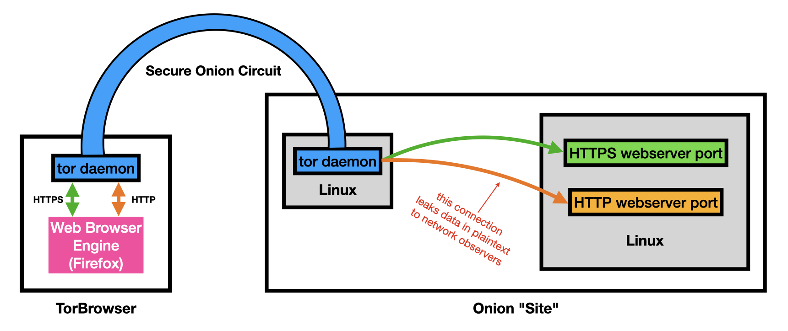

# Security Advisory: Tor Browser Leaks "Secure Cookies" Into Insecure Backend Channels

* v1.2 - 27 July 2020, alec.muffett@gmail.com - update links to gitlab bugs
* v1.1 - 27 July 2020, alec.muffett@gmail.com - grammar fixes, typos and linkifies
* v1.0 - 27 July 2020, alec.muffett@gmail.com - initial

The master copy of this document resides at:

* https://github.com/alecmuffett/eotk/blob/master/docs.d/security-advisories.d/001-torbrowser.md

## Audience

All users and operators of `.onion` websites, especially (but not
limited to) sites containing "mixed content" HTTPS and HTTP.

## Impact

TorBrowser leaks "secure" cookies that were issued over HTTPS into
cleartext HTTP channels that may be observable by third parties in
backend deployments.

This risk is not visible to the end-user.

## How to determine if you are impacted

### Site Users

Contact your site operators to ask if they are impacted.

### Site Owners: Onion Services

Check all instances of `tor.conf` on your deployed systems; if there
is a configuration line for port 80 that looks like one of the
following:

```
HiddenServicePort 80 <ipaddress>
HiddenServicePort 80 <ipaddress>:<portnum>
HiddenServicePort 80 <hostname>
HiddenServicePort 80 <hostname>:<portnum>
```

Then you are at-risk, **unless** one of the following holds:

1. the value of `<ipaddress>` is `127.0.0.1` or some other
   locally-bound IP address for the server that is running the tor
   daemon
2. the `<hostname>` is `localhost`.

You are most likely to be at risk if hosting your environment in a
"cloud" or "cloud-like" infrastructure, but you should also consider
the following issues whether or not you use cloud hosting for your
onion site.

### Site Owners: Reverse Proxies, Load Balancers

You are also at risk if you operate a reverse proxy (e.g. EOTK) or a
layer-7 load balancer that receives port 80 HTTP traffic from Tor via
any means (e.g. a Unix domain socket) which is then passed onwards to
the upstream website without modification and/or without putting in
place some additional **TorBrowser-specific** security infrastructure.

## Background

### Why we are seeing this behaviour

TorBrowser, almost uniquely amongst web browsers, implements "onion
networking" as an alternative layer-3 transport similar to TCP/IP;
onion networking provides secure communications to a cryptographic
network address, in a manner similar to a layer-3 VPN or an
IPsec-protected TCP/IP connection.

In recent software changes that were made to address a series of
feature requests:

* https://gitlab.torproject.org/tpo/applications/tor-browser/-/issues/21537
* https://gitlab.torproject.org/tpo/applications/tor-browser/-/issues/23247
* https://gitlab.torproject.org/tpo/applications/tor-browser/-/issues/21952
* https://bugzilla.mozilla.org/show_bug.cgi?id=1382359

...TorBrowser developers made the novel architectural decision that
`HTTPS` and `Plain HTTP Over Onion` should be treated as the same
thing and should share the same "first party isolation" properties,
without apparent regard to how an onion-site's backend implementation
might be shaped.

This means that "Secure" cookies which were issued to the client over
a HTTPS channel, will by default be sent back to the same server via
both HTTPS-over-Onion (safe) and **also** via HTTP-over-Onion (novel,
unexpected, potentially risky).

### Consequences of this behaviour

The web relies upon "cookies" as small pieces of data that enable
websites to carry some form of "state" - for instance that an incoming
request belongs to a user who has previously authenticated.

For purposes of security, certain cookies (usually: authentication- or
identity-related) may be marked as **"Secure"** to prevent them being
sent over insecure plaintext HTTP channels.  Although (by a quirk)
they may be legitimately sent over any channel, the "Secure" tag
requires that the cookies are only ever **returned** from the client
to the server over HTTPS.

This behaviour is considered one of the fundamentals of web
architecture, such that many server deployments reasonably do not
bother to protect or filter legacy plaintext HTTP connections within
their backend infrastructure because no data of any consequence will
ever be sent to them by any browser.

Unfortunately with this change, TorBrowser has moved from being one
which implements simply a superset of layer-3 connectivity, to one
which instead has "special needs" for deployment because it treats
plaintext HTTP as a secure channel on par with HTTPS - and does not
match the above assumptions upon which most websites are built.

> 

> image: the blue onion circuit protects HTTP traffic only up to the
> point where the circuit terminates; with this change TorBrowser now
> leaks "Secure" cookies across the orange link, in a novel way that
> other browsers would not do, and which software and administrators
> would not typically expect.

If for instance a HTTPS-enabled website `foo.onion` issues a "Secure"
session cookie for the whole `foo.onion` domain, it typically will not
expect the client to return that cookie to a third-party CDN which is
hosted on plaintext HTTP at `http://cdn.foo.onion/` - e.g. one that is
accessed via a reverse-proxy load-balancer virtual IP address set up
to handle traffic that arrives over port 80 of the `foo.onion` onion
circuit.  Such a reverse proxy might forward such data to Cloudfront,
Fastly or Cloudflare, for handling.

However: with this change TorBrowser **in specific** will leak session
cookies to those third-party CDN sites, which will traverse the
`foo.onion` virtual private cloud, if not the whole internet, in
cleartext where the cookies may be logged and captured by state
surveillance agencies if no other.  This problem should be familiar to
people who have seen the "SSL added and removed here" slides from the
Snowden files.  No other properly configured browser would behave this
way.

### Alternatives to this behaviour

The goal of this change was apparently to enable sites to be adapted
to issue secure cookies for the purposes of enabling login.  Tor
excuse this behaviour as being "standards-compatible" and cite
https://www.w3.org/TR/secure-contexts/ section 3.2 as explicitly
permitting a user agent to define a secure context as it sees fit.

Tor further have framed the backend impact as a "communications"
issue, that any surprise and impact of this change should primarily
have been addressed through education of site administrators with
resulting software changes.

The author would argue that the less surprising way to achieve this
goal would be to bring zero-cost HTTPS to Onion Networking - e.g. via
LetsEncrypt, or by canonisation of special, self-signed certificates -
rather than to attempt to revive HTTP as a protocol by making it an
equivalent partner to HTTPS because of an initial layer-3 transport
step.

Tor counter this argument on the basis that HTTPS-over-Onion is less
efficient and more verbose - in the nature of superencryption - than
to assume that the termination of the layer-3 onion connection is
secure with respect to onward plaintext HTTP access.

### Context: Mitigations proposed by Tor

The author has discussed the matter at length with Tor, who have
apparently
(https://gitlab.torproject.org/tpo/applications/tor-browser/-/issues/40033)
commited to the behaviour as an enabler for brand-new ".onion"
websites irrespective of impact upon current deployments or future
software assumptions.

Tor has proposed that the actual problem at hand is that implementers
need to provide a **"secure backhaul"** between their tor daemon and
the webservers which implement their port 80 services.  In practice
this would presumably mean either of:

* implementing layer-3 IPsec or VPN communications between the
  tor-daemon server and the HTTP servers that provide port 80 content,
  in order to protect unnecessary data that TorBrowser in particular
  may choose to send to them; or...
* implementing uplift of port 80 communications to HTTPS - assuming
  that it is feasible and possible to do this - again purely in order
  to protect unnecessary data that TorBrowser in particular may choose
  to push down a port 80 connection.

A version of the latter mitigation is already implemented as an option
by EOTK (below) but it breaks some websites that get caught in
infinite redirect loops, which may be uneconomic for the site
operators to fix.

### Web Browsers: Potential Technical Mitigations

An interested third party proposed a potential mitigation, that
first-party isolation be further modified to become
"scheme-and-transport aware", so that:

* Cookies issued over HTTPS-over-Onion
* Cookies issued over HTTPS
* Cookies issued over HTTP-over-Onion
* Cookies issued over HTTP

...for a given site would all be considered "distinct" and only be
returned to servers whose URLs operated at-or-above the same "security
level", so to speak.

This proposal is currently hanging, and is not (apparently) being
further discussed.  This proposal would be orthogonal with existing
web practice, but not as easily as "enabling HTTPS for Onion sites"
would, because it would still require modification to tell deployed
software stacks "don't worry, it's okay that you're not configured
with a HTTPS URL for special reasons that you probably weren't written
to understand."

### Practical Mitigations: EOTK Users

If you are using EOTK, you should update your software and
configuration, and in particular you should set:

```
set force_https 1
```

...which is the default value for that setting.  If you have manually
set `force_https` to `0` then you should revert that change, rebuild
your configuration, and test your site. Some parts of your site may
break. If you need to re-disable forced-HTTPS, then you should
consider the potential risk of content interception before doing so.
If necessary, contact the author to discuss.

### Practical Mitigations: Other Onion-Site Operators

Operators of other large onion sites should consider their deployment,
and whether a systemic risk is presented by virtue of TorBrowser
sending authentication, session, and other "Secure" cookies as part of
requests to fetch resources over HTTP via the Onion circuit.

This consideration should include the nature of your deployment, the
nature of your (e.g. shared-hosting cloud) infrastructure, and the
potential risks to users of exposure of such "Secure" cookie content
to untrusted or third parties.

If this risk is considered excessive, you may wish to consider
disabling port 80 services on your Tor daemon, or possibly send port
80 requests to a custom-built HTTP server within your security
perimeter, for special processing such as customised cookie-stripping.
Or - to be frank - you may wish to consider disabling your onion site
if the risks are excessive and the costs to mitigate are too great.

## Likely FAQs

### Does this mean that "The Dark Web" is broken?

No. This issue is purely a function of TorBrowser and how it chooses
to behave and manage cookies for websites which it accesses over HTTP
and Onion Networking. There are no impacts upon other browsers nor upon
fundamental layer-3 onion networking for (say) SSH-over-Onion.

### Does this impact mobile?

The author does not yet know whether this change impacts either of
"TorBrowser" for Android or "OnionBrowser" for iOS.

### "Is this a NSA Backdoor", etc?

The author does not believe that this is wittingly any form of
backdoor, but rather appears to be driven out of a motivation to
increase adoption of Onion Services. Unfortunately the path currently
chosen towards this goal includes reviving HTTP as a protocol,
requiring differing assumption of data protection than the rest of the
web, and it puts at risk of interception data that was formerly not at
risk.
